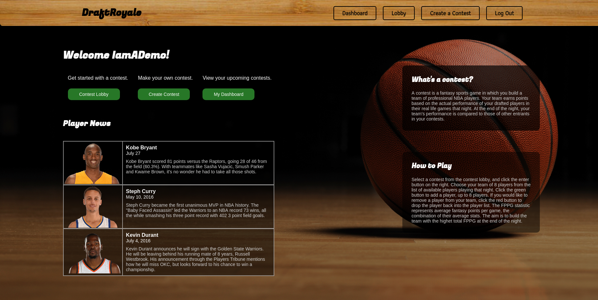
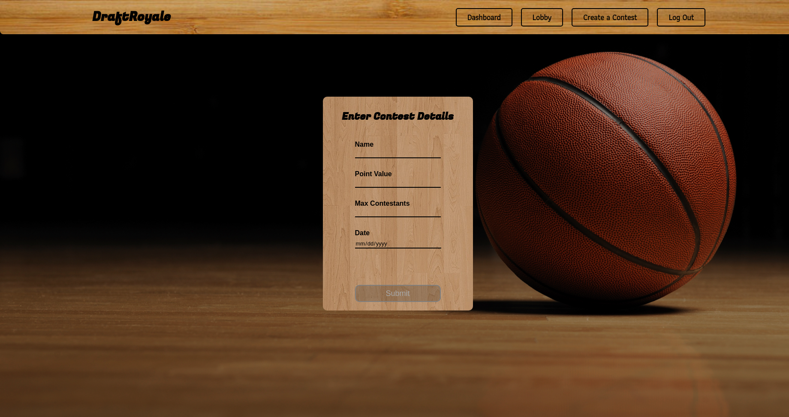
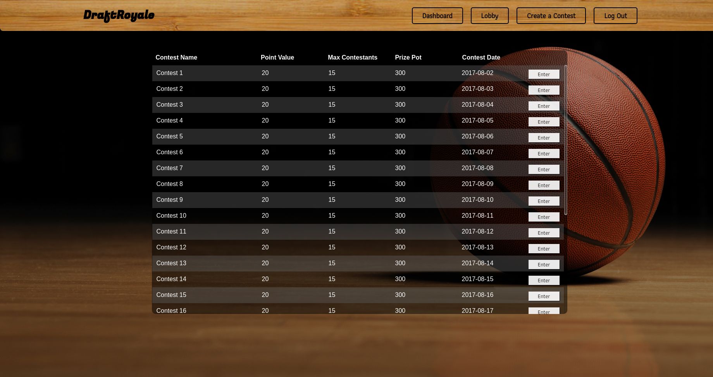
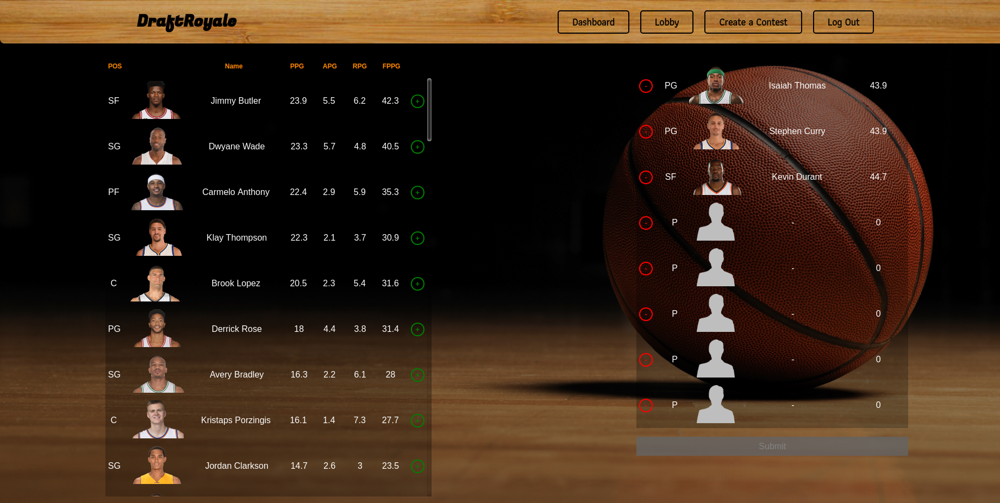
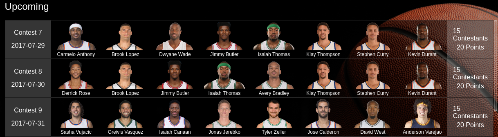

# DraftRoyale

Draft Royale is a web-app to enhance your NBA experience, written by Spencer Chan.

[DraftRoyale](www.draftroyale.co 'DraftRoyale Homepage')

## Features

- Secure user authentication
- Creating public contests for anyone to enter
- Contest lobby to view or enter all contests
- Drafting interface to form the ideal team to enter contests
- Dashboard to view your upcoming contests and past contests

## Project Design

DraftRoyale was designed and built in two weeks, based off the concept of Daily Fantasy games, without the gambling risk.

### Implementation

#### Authentication
- Users are prompted to log in through a modal before options for contests appear
- Attempting to manually go to other pages will redirect to homepage if not logged in
- Accomplished using `Redirect` from `react-router-dom`, checking the current session for a logged in User

```
import { Redirect } from 'react-router-dom';

...

if (!this.props.loggedIn) {
  return <Redirect to='/' />;
}
```

#### Landing
- After logging in or signing up, users are directed to a landing page.
- The landing page gives a run down of what DraftRoyale does.
- Links to lobby, dashboard, contest creation provided.



#### Contest Creation

- Users can create contests once logged in.
- Only accepts contests with all parameters filled out.
- Does not accept contests with past dates.
- Defaults to current date



#### Contest Lobby

- Lists all contests the user is not currently entered in.
- Backend SQL query only requests contests not entered.
- Can enter any contests and directs to draft page for contest.



```
def index
  ids = []
  current_user.entered_contests.each do |contest|
    ids.push(contest.id)
  end
  if ids.length > 0
    @contests = Contest.where('id NOT IN (?)', ids)
  else
    @contests = Contest.all
  end
  render :index
end
```
The above code is a modified return on the `GET` index route to `api/contests` to perform the equivalent query:

```
SELECT
  *
FROM
  contests
WHERE
  id NOT IN (ids)
```

#### Draft Page

- Based on contest date, game schedule is loaded.
- Player list is generated based on only teams playing that day.
- Players can be drafted onto user team, or dropped back into the player list.
- User team can have a maximum of eight players, at which point the submit button becomes available.
- Animations done with Animate CSS.



#### Dashboard

- Dashboard shows the contests a user has entered
- Based on date, contests are distributed into past or upcoming
- Entries are searched based on current user entries.
- SQL modification on the index route of Entries provides only entered contests by the current user.



## Future Plans

### Frontend

- Graphs representing the users contests entered over time
- Profile information, tracking points
- Live updating scoreboard for current events

### Backend

- System for automatically updating database with real information
- Form of calculating the results of contests in real time
